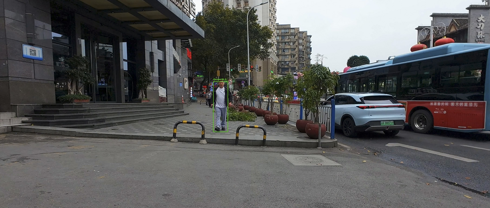
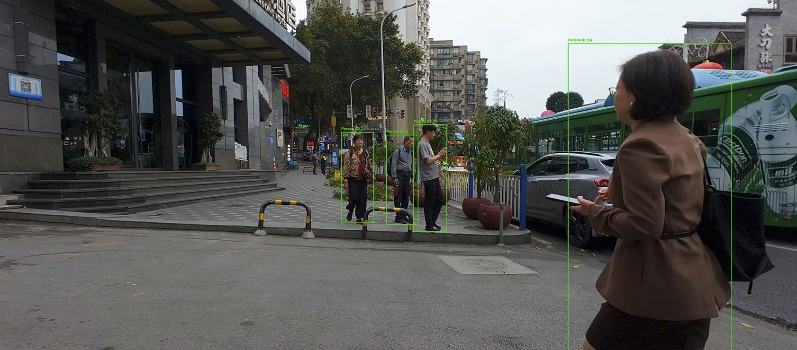

# People Detection and Tracking

This project detects and tracks people in a video using YOLO, ByteTrack and OpenCV.

I built this project to understand how object detection and multi-object tracking work together. The program takes a video as input, detects people in each frame and assigns an ID to each person so they can be tracked as they move.

## Demo




## What it does

- Detects people in a video
- Tracks multiple people at the same time
- Assigns an ID to each tracked person
- Shows a bounding box around each person
- Shows the current number of people being tracked
- Saves the processed video

## Tools used

- Python
- YOLO
- ByteTrack
- OpenCV
- Google Colab

## How it works

The video is read frame by frame using OpenCV.

YOLO is used to detect people in each frame. The detections are then passed to ByteTrack, which tracks the people between frames and assigns IDs.

The result is displayed with a bounding box and ID around each person.

Example:

```text
Person ID: 1
Person ID: 2
Person ID: 3

People Tracked: 3

```text

## Why I chose this approach

I chose YOLO because it is a popular object detection model that can detect objects quickly and works well for video-based applications.

I used ByteTrack for tracking because it can associate detected objects between consecutive frames and assign tracking IDs. This allowed me to track multiple people without having to build a separate tracking algorithm from scratch.

I used OpenCV to read the video, draw bounding boxes and IDs, and save the final output video.

## Detection and tracking pipeline

The system processes the video frame by frame.

1. OpenCV reads a frame from the input video.
2. YOLO detects people in the frame.
3. The person detections are passed to ByteTrack.
4. ByteTrack associates people with existing tracks and assigns tracking IDs.
5. Bounding boxes and IDs are drawn on the frame.
6. The current number of tracked people is displayed.
7. The processed frame is written to the output video.

The basic pipeline is:

Input Video → YOLO Detection → ByteTrack → ID Assignment → Bounding Boxes + Count → Output Video

## Challenges I encountered

One of the first challenges was getting the video processing and detection working correctly in Google Colab.

During testing, I also noticed that ByteTrack could produce tracking IDs such as 273 or 493 instead of simple numbers. I added an ID mapping so that the IDs displayed in the final video are easier to understand.

Another challenge was processing and displaying every video frame during testing. This made the notebook very slow, so I changed the testing approach to avoid displaying every frame.

Tracking can also become less reliable when people overlap, move out of view, or are temporarily hidden.

## Improvements for real-time deployment

For a real-time system, I would make several improvements:

- Use a faster or optimized YOLO model depending on the hardware.
- Use GPU acceleration for faster inference.
- Process frames efficiently and avoid unnecessary image conversions.
- Tune the ByteTrack parameters for the specific camera environment.
- Add better handling for people who temporarily disappear.
- Use a live camera stream instead of a pre-recorded video.
- Measure FPS and latency to monitor real-time performance.
- For more difficult scenes, consider stronger tracking methods or appearance-based re-identification.
